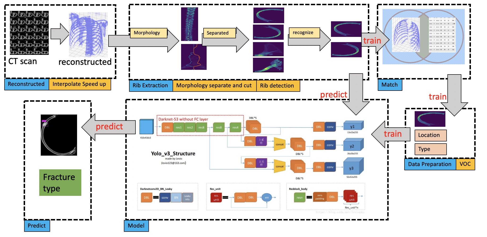

## Refed

**Refed (Rib Extaction and Fracture Detection Model)** by [Youyou Jiang](jiangyy5318@gmail.com) and [Shiye Lei](leishiye@gmail.com). Our model has a great performance on **extracting ribs** and **detecting fracture** from CT images. The model is based on python 3.6. 

Refed is consist by two modules: **rib extraction module** and **fracture detection module**. *First*, we design algorithm based on computer vision for extracting ribs from CT images. *Second*, we design DNN based on [faster-rcnn](https://github.com/endernewton/tf-faster-rcnn) for detecting fracture location with these ribs.


### Workflow





## Installation and Dependencies

+ Install tensorflow. It is required that you have access to GPUs, The code is tested with Ubuntu 16.04
Python 3.6+, CUDA 9.0.176 and cudnn 7.4.2.
+ Python dependencies (with `pip3 install`):
```
    tensorflow-gpu==1.12.0
    pandas==0.23.4
    scikit-learn==0.20.0
    numpy==1.16.2
    matplotlib==3.0.0
    PIL==Pillow
    lxml==4.2.5 
```
+ Clone the repository
```shell
    git clone https://github.com/jiangyy5318/medical-rib.git
```


## Run demo

You can download pre-trained models, including GBDT model [HERE](https://drive.google.com/open?id=1_-dP4Y6wYDC5lqQ4uaIcXrAM-AHT_xd7), 
GBDT features [HERE](https://drive.google.com/open?id=1R8OkfLWniBhjFkAAYDlTWYwavt4dYaiB) and yolo-v3 models [HERE](added). Put `feature.pkl`, `gbdt.pkl` under the project root path (`/path/to/project/experiments/cfgs`) and 
Put `?.pkl` under the project root path (`/path/to/project/demo_files`) 

The demo uses a pre-trained GBDT model, 

(on SUN RGB-D) to detect objects in a point cloud from an indoor room of a table and a few chairs (from SUN RGB-D val set). You can use 3D visualization software such as the [MeshLab](http://www.meshlab.net/) to open the dumped file under `demo_files/sunrgbd` to see the 3D detection output. Specifically, open `***_pc.ply` and `***_pred_confident_nms_bbox.ply` to see the input point cloud and predicted 3D bounding boxes.


python3 demo.py

Also, you can 


## Training and evaluating

### Data Preparation

For GBDT models,


./experiments/scripts/nii_read.sh [DATA] [SLICING]
./experiments/scripts/dcm_read.sh [DATA]
./experiments/scripts/ribs_obtain.sh [LOGS_DIR] [FORMAT] [SLICING]
./experiments/scripts/prepare_data.sh 

dcm file and nii file;

### Data


### train gbdt model (generated )

- feature.pkl

- gbdt.pkl


### 


### metric
### Generate the separated ribs
1. Read Every patients' CT image and save its 3D array;
    ```shell
    ./preprocessing/dicom_read/dcm_to_3d_pkl.sh  [PATIENT_DCM_FOLDER]  [PATIENT_PKL_FOLDER]
    ```
2. Seperate all the bone and collect all the ribs among them from 3d bone structure for every patient. The method in which we sepeated and collected was detailedly described, see details,please refer to [seperated and collect]()
    ```shell
    /preprocessing/rib_cut_v6/run.sh 
    ```
3. Get the seperated-rib data;maybe need to move this title to the below parts
    ```shell
   ./preprocessing/create_voc2007/create_voc2007.sh [PATIENT_FOLDER]
    ```
4. train your own rib-recognition model to replace our internal infer models. Please refer to [link](****)

5. If you want to realize how to deal with the data, [file structure](dataSet/) and [preprocessing](preprocessing/create_voc2007) should be referenced.

### make dataSet to train detection models
1. here, we only supported voc2007 format,
    ```shell
    ./preprocessing/create_voc2007/create_voc2007.sh
    ```

### Train fragmented location detection model
1. here, we only.
    ```shell
    todo
    ```
